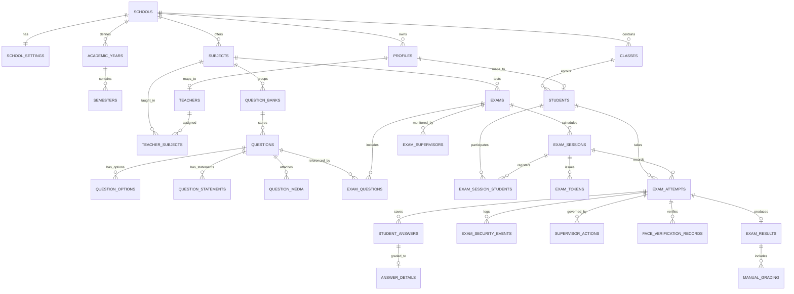

# Entity Relationship Diagram (ERD) — CBT SMART EXAM

```mermaid
erDiagram
    SCHOOLS ||--|| SCHOOL_SETTINGS : has
    SCHOOLS ||--o{ PROFILES : owns
    SCHOOLS ||--o{ ACADEMIC_YEARS : defines
    ACADEMIC_YEARS ||--o{ SEMESTERS : contains
    SCHOOLS ||--o{ CLASSES : contains
    SCHOOLS ||--o{ SUBJECTS : offers
    PROFILES ||--o| STUDENTS : maps_to
    PROFILES ||--o| TEACHERS : maps_to
    CLASSES ||--o{ STUDENTS : enrolls
    TEACHERS ||--o{ TEACHER_SUBJECTS : assigned
    SUBJECTS ||--o{ TEACHER_SUBJECTS : taught_in

    SUBJECTS ||--o{ QUESTION_BANKS : groups
    QUESTION_BANKS ||--o{ QUESTIONS : stores
    QUESTIONS ||--o{ QUESTION_OPTIONS : has_options
    QUESTIONS ||--o{ QUESTION_STATEMENTS : has_statements
    QUESTIONS ||--o{ QUESTION_MEDIA : attaches

    SUBJECTS ||--o{ EXAMS : tests
    EXAMS ||--o{ EXAM_QUESTIONS : includes
    QUESTIONS ||--o{ EXAM_QUESTIONS : referenced_by
    EXAMS ||--o{ EXAM_SESSIONS : schedules
    EXAM_SESSIONS ||--o{ EXAM_SESSION_STUDENTS : registers
    STUDENTS ||--o{ EXAM_SESSION_STUDENTS : participates
    EXAMS ||--o{ EXAM_SUPERVISORS : monitored_by
    EXAM_SESSIONS ||--o{ EXAM_TOKENS : issues
    EXAM_SESSIONS ||--o{ EXAM_ATTEMPTS : records
    STUDENTS ||--o{ EXAM_ATTEMPTS : takes

    EXAM_ATTEMPTS ||--o{ STUDENT_ANSWERS : saves
    STUDENT_ANSWERS ||--o| ANSWER_DETAILS : graded_to
    EXAM_ATTEMPTS ||--o{ EXAM_SECURITY_EVENTS : logs
    EXAM_ATTEMPTS ||--o{ SUPERVISOR_ACTIONS : governed_by
    EXAM_ATTEMPTS ||--o{ FACE_VERIFICATION_RECORDS : verifies
    EXAM_ATTEMPTS ||--o| EXAM_RESULTS : produces
    EXAM_RESULTS ||--o{ MANUAL_GRADING : includes
```
